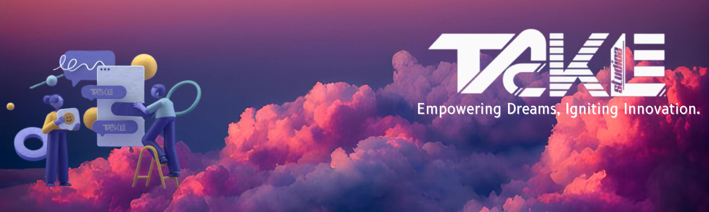

## About Us

Tackle Studioz is an innovative IT services and consulting company committed to empowering startups, businesses, and individuals to transform their ideas into reality. From web and app development to gaming solutions, AI technologies, and hardware integrations, we specialize in crafting cutting-edge solutions that redefine the future of technology.

## Our Mission

To foster innovation, creativity, and growth by providing tailored solutions that help startups and businesses thrive in the modern digital landscape.

## What We Do

At Tackle Studioz, we focus on delivering excellence across multiple domains:
- **Web Development:** Building responsive and scalable web applications.
- **App Creation:** Designing seamless and intuitive mobile applications.
- **Gaming Solutions:** Developing immersive gaming experiences.
- **AI Innovations:** Implementing AI-driven solutions for modern challenges.
- **Hardware Integrations:** Bridging the gap between digital and physical with smart hardware.

## Our Values

- **Innovation:** Pushing boundaries to create groundbreaking solutions.
- **Collaboration:** Partnering with startups and businesses to achieve mutual success.
- **Empowerment:** Enabling entrepreneurs and professionals to thrive in their fields.

## Get Involved

This GitHub organization is home to our open-source projects, collaborative tools, and experimental solutions. Whether you're a developer, entrepreneur, or enthusiast, you're welcome to explore, contribute, and innovate with us!

## Contact Us

📧 Email: studioz.tackle@gmail.com 
---

Together, let's tackle challenges, innovate solutions, and redefine possibilities. 🌟
